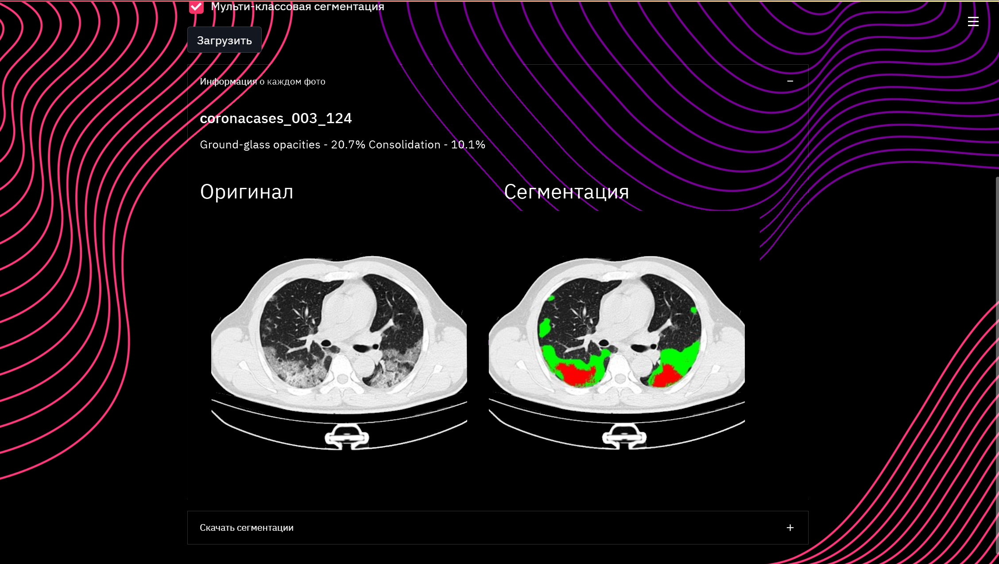
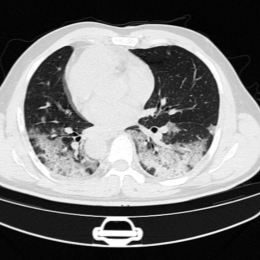
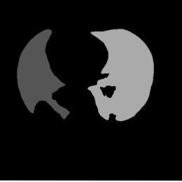
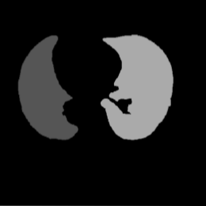

# AIIJC. The "AI in Medicine" competition track

## Competiton overview

Artifical Intelligence International Junior Contest (AIIJC) has 10 tracks on different themes. \
This repository contains the code for the "AI in Medicine" track. \
Specific of competition is that all participants must be under 18 years old.

The main organizer and sponsor of the competition is Sberbank. \
Organizer and task developer is Alliance for Artificial Intelligence.

## Data

Competition don't provide any data. \
So we find 3 datasets for training and testing our models:

* [MosMedData](https://mosmed.ai/datasets/covid19_1110/)
* [MedSeg](http://medicalsegmentation.com/covid19/)
* [Zenodo](https://zenodo.org/record/3757476#.YRqU0IgzbP_)

## Methods

### Pathology segmentation

For this task we used:

* 2 pretrained Unet++ with backbone EfficientNet-B7 for 2 classes: \
  COVID-19 ground glass and COVID-19 consolidation.
* Loss function is IoU
* Optimizer is Adam with learning rate 1e-4

### Lungs segmentation

Our task need percentage of pathologies per lung. \
So we need to segment lungs. \
For this task we prepared specific computer vision pipeline.

1. The mask of pathology was subtracted from the image
   We did it because pathology prevents
   us from seeing the lungs (they are totally black, pathology - gray/white).
2. Find 2 largest contours in the image
   The contours are the lungs.
3. Delete image by half and find max overlaps for each contour with half of the image.
   Here we find the lungs that are on the left and right. (in dicom we have info about the side of the image)
4. Cut mask of pathology by contours of lungs
   Our model isn't perfect, so we need to cut the mask of pathology by contours of lungs.
   This was we reached better accuracy.
5. Calculate percentage of pathology per lung

Let's see how it works in images:
...

## Results



|            image             |      base opencv adaptive thresholding      |         ours adaptive thresholding          |
|:----------------------------:|:-------------------------------------------:|:-------------------------------------------:|
|  |  |  |

## Run code

First of all set up your environment with
Install folder with model
checkpoints: [link](https://drive.google.com/file/d/19svztOBB4RhnW7cwuZTDPZb0EiWKdydN/view?usp=sharing)

```bash
pip install -r requirements.txt
```

To activate web interface run

```bash
streamlit run streamlit_app.py
```

To activate app in bash run

```bash
python3 bash_app.py --data <image folder> --save_folder <dst folder> --multi --show_legend
```
